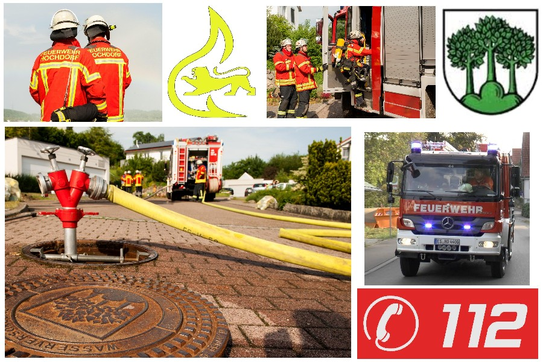

\page "Über uns"

## Freiwilligen Feuerwehr Hochdorf (73269 Lkr. Esslingen),

Schön, dass Sie mal bei uns reinschauen.

Auf dieser Seite sind keine Inhalte hinterlegt, verfolgen Sie unsere Aktivitäten auf unserer Facebook-Seite,
diese können Sie auch sehen, ohne dort angemeldet zu sein.

[Hier geht's zur Facebookseite der FF Hochdorf](http://www.feuerwehr-hochdorf.de/home/ffw/berichtefb.html)

### Ansprechpartner

|Amt|Person|Mail|
|-|-|-|
|Kommandant|Jochen Schmid|kommandant@feuerwehr-hochdorf.de|
|Stellv. Kommandanten|Marc Behringer und Michael Single|info@feuerwehr-hochdorf.de|
|Gerätewarte|Michael Single und Fabian Bodor|geraetewart@feuerwehr-hochdorf.de|
|Presse/Öffentlichkeitsarbeit| |pr@feuerwehr-hochdorf.de|

**Anschrift Feuerwehrgerätehaus:**  
Bachstr. 1  
73269 Hochdorf  
Tel. 07153/925880  

> Bitte beachten Sie, dass das Feuerwehrhaus nur im Einsatzfall besetzt ist.
Bei Notfällen wählen Sie bitte immer die 112
