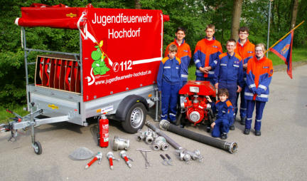

\page "Jugendfeuerwehr"

Du wolltest schon immer mal in einem Feuerwehrauto mitfahren, wie ein Feuerwehrmann/-frau Schläuche rollen, Menschen aus Autos retten oder Brände löschen?

Dann bist Du bei der Jugendfeuerwehr genau richtig!

Die Jugendfeuerwehr ist eine sinnvolle Freizeitgestaltung mit viel Spaß. Moderne Technik und eine umfassende Ausbildung erwarten Dich hier bei uns. Anderen zu helfen ist unser Ziel.  Besonders wichtig ist uns die Förderung der Kameradschaft, wie  z.B. bei tollen Zeltlagern, Ausflügen, Wettbewerben und anderen aufregenden Veranstaltungen oder dem gemeinsamen  Beisammensitzen nach einer Übung. Bei regelmäßigen Übungen und Wettbewerben kannst Du dein  Können unter Beweis stellen.  In der Jugendfeuerwehr kannst Du zeigen, was Du kannst. Wenn Du 10 Jahre alt bist und auch zur Jugendfeuerwehr kommen möchtest, dann bist Du herzlich Willkommen.
