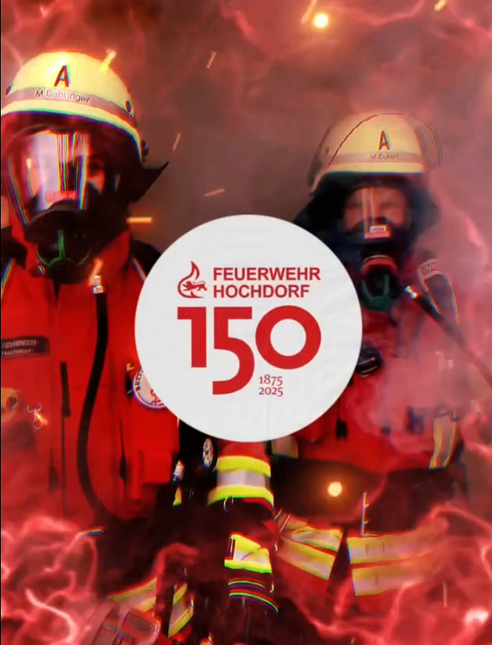

\page "Programm"

## Freitag

* 19 Uhr Fassanstich mit Bürgermeister Gerhard Kuttler, anschließend Wasen-Party mit Mickie Krause und der Band Just for Fun

## Samstag

* 14 Uhr Dorfspiel der Jugendfeuerwehren
* 19 Uhr Abend der Hochdorfer Vereine

## Sonntag

* 10 Uhr Ökumenischer Gottesdienst im Festzelt
* 11 Uhr Frühschoppen, Feuerwehr-Oldtimer Treffen
* 14 Uhr großer Festumzug durch Hochdorf anschließend Fahneneinmarsch
* 16 Uhr musikalische Unterhaltung mit den Musikvereinen aus der Umgebung 19 Uhr Festausklang mit dem Musikverein Hochdorf

_Für Essen und Trinken ist an allen 3 Tagen bestes gesorgt, Freitag und Samstag Barbetrieb!_

